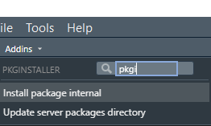
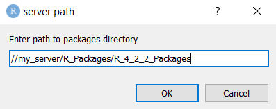

<!-- README.md is generated from README.Rmd. Please edit that file -->

# pkginstaller

<!-- badges: start -->

[](https://github.com/DataScienceScotland/pkginstaller/actions)
<!-- badges: end -->

An R Studio Add-in to make it easier to install packages from an
internal server.

For locked down IT environments where cannot install packages from CRAN
directly, but where packages are stored on an internal server.

## Installation

You can install pkginstaller from [GitHub](https://github.com/) with:

``` r
remotes::install_github("DataScienceScotland/pkginstaller", upgrade="never")
```

If security settings prevent you installing this package from GitHub
directly, download its [zip
file](https://github.com/DataScienceScotland/pkginstaller/archive/refs/heads/main.zip)
and use the code below to install (after replacing
`<FILEPATH OF ZIPPED FILE>` with the directory of the downloaded zip):

``` r
remotes::install_local(
  "<FILEPATH OF ZIPPED FILE>/pkginstaller-main.zip",
  upgrade = "never"
)
```

## Packages directory

It is recommended that the directory containing the packages has
PACKAGES index files, created with:

``` r
tools::write_PACKAGES(dir = "packages_dir", type = "win.binary")
```

The index files allow a package to be installed and its dependent
packages to be installed automatically.

## Package installation prcoess

This makes use of the `contriburl` argument of `install.packages` to
specify the server directory. For example:

``` r
install.packages("tidyr", repos = NULL, type = "win.binary", contriburl = "file://internal_server/r422_packages")
```

## Using the add-in

Once the package is installed, use the pkginstaller Addins found in R
Studio



## Installing a package with the add-in

Select “Internal install package” from the pkginstaller Addin menu. A
pop-up will open where should specify the name of the package to
install.


## Checking the current packages server directory

Select “Show packages directory” from the pkginstaller Addin menu. The
current directory should be printed in the console.

## Updating the current packages server directory

If the current check shows the directory needs changing, then run
“Update packages directory” from the Addin menu. A pop-up will open and
should specify the updated directory containing packages to install.



When specifying the server directory, please note:

1.  Use forward slashes not back slashes in the directory as would be
    used in R code.

2.  It is not necessary to specify `file:` at the start of the directory
    as this will be added automatically.
